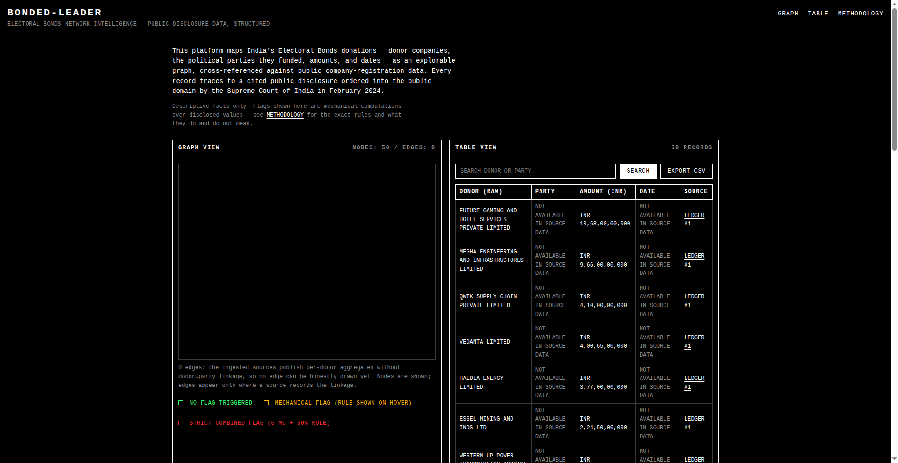

# BONDED-LEADER

**Network-intelligence platform mapping India's Electoral Bonds disclosures — donor companies, parties, amounts, dates — as an explorable, fully cited graph.**



[](https://nextjs.org/)
[](https://www.typescriptlang.org/)
[](https://neon.tech/)
[](LICENSE)

**Live demo:** https://bonded-leader-djy6jku8i-largereporter25s-projects.vercel.app

In February 2024 the Supreme Court of India struck down the Electoral Bonds Scheme and ordered full disclosure of donor, party, and amount data. The State Bank of India submitted the data to the Election Commission of India (ECI), which published it. BONDED-LEADER structures those public disclosures — plus ADR/MyNeta compilations and MCA21 company-registry filings — into a searchable graph and table where every record traces to a cited source.

---

## Data provenance

Every ingestion batch is sealed in a public `ingestion_ledger` (source URL, retrieval date, SHA-256 of the raw file, row count) **before** any of its rows are displayed. Every displayed record links to its ledger entry.

| Batch | Source | Rows | SHA-256 | Retrieved |
|-------|--------|------|---------|-----------|
| #1 | [ADR Part 3: Donor-wise Electoral Bonds details](http://adrindia.org/sites/default/files/Part_3_Donor-wise_EBs_details_Final.pdf) — corporate & individual donors, 12 Apr 2019 – 15 Feb 2024; compiled by ADR from ECI data as of 14 Mar 2024 | 50 | `9c530edba309…` | 2026-09-23 |

**What NULL means.** Batch #1 publishes per-donor aggregate totals: it prints no per-bond dates and no donor→party linkage. `party_name` and `bond_date` are therefore NULL for all 50 rows and display as `NOT AVAILABLE IN SOURCE DATA` — never blank, never guessed. The graph shows donor nodes with zero edges until a source recording real donor→party linkage is ingested; no edge is ever synthesized.

---

## Methodology

**Entity resolution.** A company may appear under variant spellings across datasets. Names merge into one canonical node only when their Jaro-Winkler similarity score is **≥ 0.90**. Every merge is logged with its exact score. (Batch #1: 1,225 pairwise decisions, 0 merges — all 50 names distinct at the threshold.)

**Anomaly flags — mechanical rules only.** A flag states that two disclosed values stand in a stated numerical relationship. Each flag is always shown with its exact rule text and the computed value that triggered it. Flags are not allegations of wrongdoing, corruption, or improper intent; they do not imply a donation was unlawful or that any quid pro quo occurred.

- **AMBER — Incorporation-timing flag (12-month rule):** "Incorporation-timing flag (12-month rule): triggered when the donor company's MCA21 incorporation date falls within the 12 calendar months preceding the bond purchase date recorded in the ADR/ECI dataset. This flag records the observed date interval only; it is not an allegation of wrongdoing."
- **AMBER — Turnover-ratio flag (50% rule):** "Turnover-ratio flag (50% rule): triggered when the declared bond donation amount exceeds 50% of the company's most recently disclosed annual turnover, where the turnover figure is itself sourced from a public MCA21 filing. This flag records the observed amount ratio only; it is not an allegation of wrongdoing."
- **RED — Strict combined flag (6-month + 50% rule):** "Strict combined flag (6-month + 50% rule): triggered only when BOTH (a) the donor company's MCA21 incorporation date falls within the 6 calendar months preceding the bond purchase date recorded in the ADR/ECI dataset, AND (b) the donation amount exceeds 50% of the company's most recently disclosed annual turnover from a public MCA21 filing. This flag records the observed combination of facts only; it is not an allegation of wrongdoing."

**Current flag state:** 0 triggered. No MCA21 registry rows have been verified yet, so the incorporation and turnover rules have nothing to compute against. The empty result is reported as-is on the site.

Node colors: green = no flag triggered · amber = at least one mechanical flag · red = strict combined flag only.

Full methodology: [/methodology](https://bonded-leader-djy6jku8i-largereporter25s-projects.vercel.app/methodology)

---

## Zero-fabrication policy

- Every donor, party, amount, and date comes verbatim from a cited source file. No demo donors, no synthetic amounts, no placeholder names — including in tests.
- Donor names are kept exactly as printed, including the source's own typesetting breaks.
- Missing fields display `NOT AVAILABLE IN SOURCE DATA`.
- Flags are pure arithmetic over disclosed values with disclosed thresholds; the triggering value is always shown.
- No language implying corruption, intent, or wrongdoing appears anywhere in the codebase or UI.

---

## Tech stack

| Layer | Choice |
|-------|--------|
| Framework | Next.js 14 (App Router) + TypeScript |
| Database | Neon serverless Postgres (`@neondatabase/serverless`) |
| Graph rendering | vis-network |
| Deploy | Vercel (production, from `main`) |
| Ingestion/parsing | Python (`scripts/`), parameterized SQL only |

---

## Repository structure

```
bonded-leader/
├── app/
│   ├── page.tsx              # home shell (server)
│   ├── home-client.tsx        # live graph + table + flags + ledger views
│   ├── methodology/
│   │   ├── page.tsx          # methodology statement
│   │   └── batches.tsx       # live ledger table
│   ├── api/
│   │   ├── donations/route.ts  # paginated ?search= donor/party records + provenance
│   │   ├── graph/route.ts      # donor/party nodes + edges (edges only where linkage exists)
│   │   ├── ledger/route.ts     # all ingestion batches
│   │   └── flags/route.ts      # triggered flags with rule text + computed value
│   └── globals.css           # brutalist theme: black, monospace, 1px hairlines
├── lib/
│   ├── anomaly.ts            # the three mechanical rules (single source of truth)
│   ├── canonicalize.ts       # Jaro-Winkler ≥ 0.90 entity resolution
│   ├── sources.ts            # real source URLs + SHA-256 helper
│   └── db.ts                 # Neon client (DATABASE_URL env only)
├── scripts/
│   ├── ingest.py             # parse → canonicalize → ledger + donations (idempotent)
│   ├── parse_adr_part3.py    # ADR donor-wise PDF parser (checksum-validated)
│   ├── jw.py                 # Jaro-Winkler port of lib/canonicalize.ts
│   └── compute_flags.py      # mechanical flag engine (rule texts read from lib/anomaly.ts)
├── data/
│   ├── MANIFEST.json         # provenance record for every batch
│   ├── merge_decisions_part3.json  # all 1,225 merge decisions + scores
│   └── raw/                  # downloaded source PDFs (hashed at ingest)
├── schema.sql                # Neon schema: ingestion_ledger, donations, company_registry, anomaly_flags
└── docs/
    └── screenshot.png        # captured from the live deployment
```

---

## Local development

```bash
npm install
```

Create a Neon Postgres database and apply the schema:

```bash
# via the project skill, or manually:
psql "$DATABASE_URL" -f schema.sql
```

Set the connection string (never commit it):

```bash
export DATABASE_URL="postgresql://..."
```

Ingest the first batch (downloads nothing new — parses `data/raw/`):

```bash
python3 scripts/ingest.py
python3 scripts/compute_flags.py
```

Run the app:

```bash
npm run dev      # http://localhost:3000
npm run build    # production build check
```

API routes read `DATABASE_URL` at request time; without it they return explicit `503` empty states rather than invented data.

---

## License

MIT — see [LICENSE](LICENSE). Data shown is from public disclosures; this project asserts no new claims about any donor or party.
